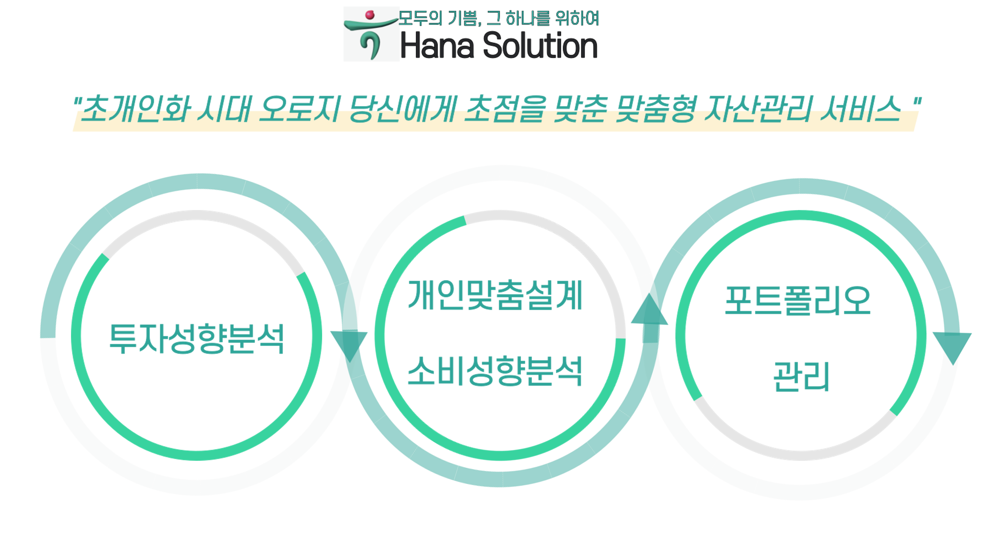
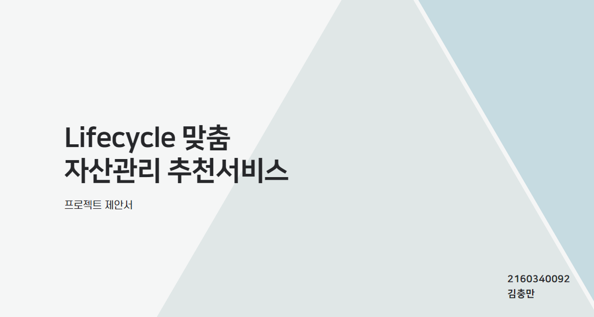
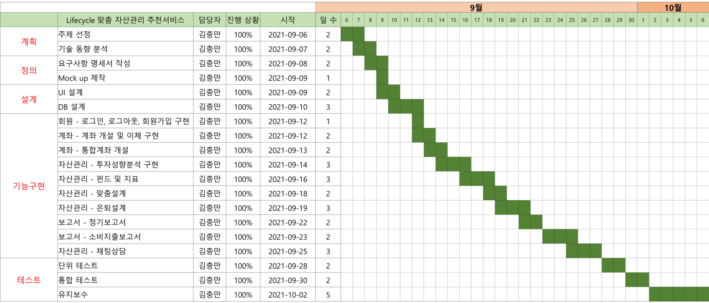
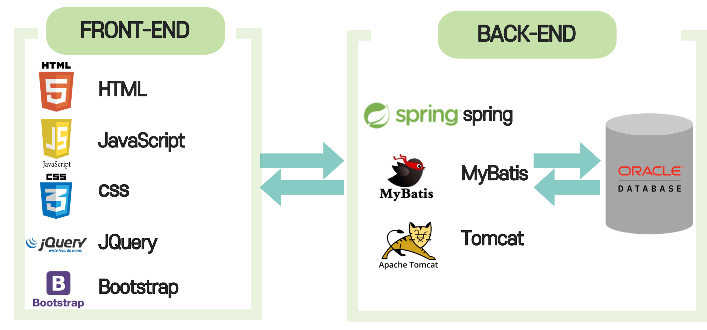
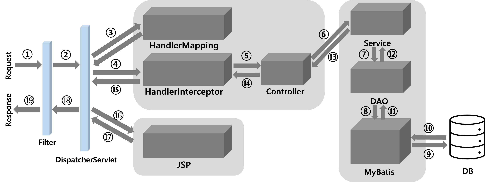
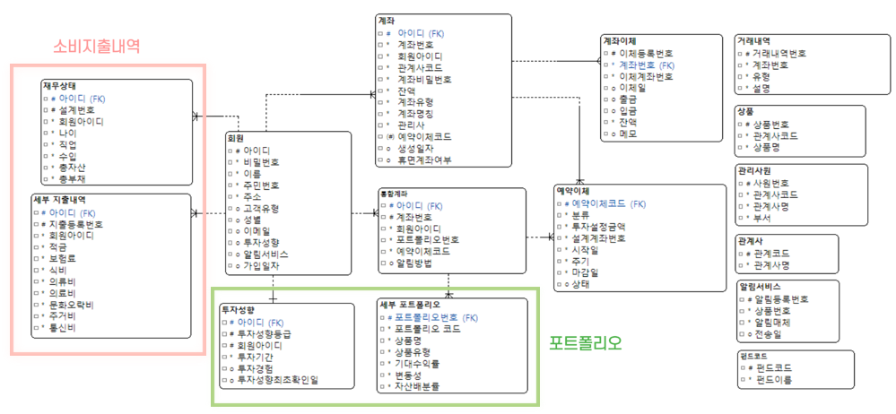
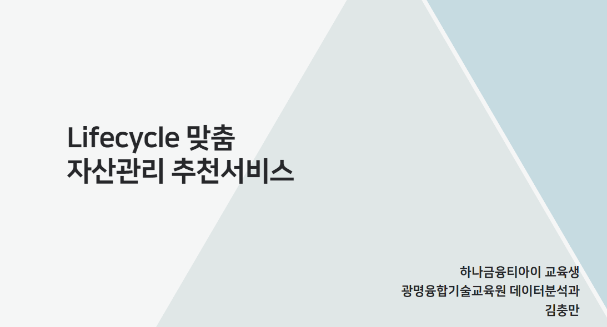
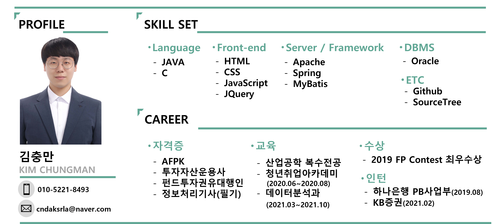

# Hana Solution (Lifecycle 맞춤 자산관리 추천서비스)
[프로젝트 홈페이지 - https://koposoftware.github.io/2021_4_cmkim/](https://koposoftware.github.io/2021_4_cmkim/)

# 1. 프로젝트 개요

   ## 1) Hana Solution이란?
   
 

      
   - <strong>__저출산 고령화__</strong></u> 문제로 길어진 노후관리에 있어 자산관리의 필요성은 연령대와 관계없이 크게 부각되고 있습니다.
   - Hana Solution은 <strong>__초개인화 시대 오로지 당신 한 분만을 위한 맞춤형 자산관리 서비스__</strong>를 제공합니다.
   - Lifecycle에 맞춘 자금설계와 개인데이터에 맞춘 소비내역 개선점을 시각적으로 알려줍니다. 
   - 정기적인 관리를 통해 고객에게 끈끈한 파트너십과 신뢰를 제공합니다.
   
# 2. 프로젝트 목적
   - 고객 개개인에 맞춘 맞춤형 자산관리 서비스를 제공한다.
   - 누구나 쉽게 설계를 받고 관리할 수 있는 서비스를 제공한다.
   - 지점과의 연계를 통해 잠재적인 고객과 소통한다.
    

# 3. 프로젝트 제안서

    
  <a href="project_proposal.pdf">발표자료</a> 
  
 
**사용기술** 
 Spring MVC - 웹 애플리케이션 제작 
 Java Mail Sender - 정기보고서 및 메일인증 
 Spring Scheduler - 매일 저녁 6시 펀드 기준가 업데이트, 예약이체 
 WebSocket - 실시간 채팅상담 및 지점상담예약 
 Apache POI - 소비거래내역 엑셀 다운로드 
 API - kakao링크 발송, Google Chart 그래프생성
 웹 크롤링 - 네이버금융 펀드내역, 하나은행 상품, 금융투자협회 공시 크롤링 
 AJAX - 실시간 비동기통신 

**간트차트** 

</a> 

**아키텍처** 

</a> 
</a> 

**ERD** 

</a> 

# 4. 프로젝트 결과

## 발표 ppt 
    
  <a href="final_presentation.pdf">발표자료</a>
 

## 시연 동영상 

 

# 4. 본인 소개

 
